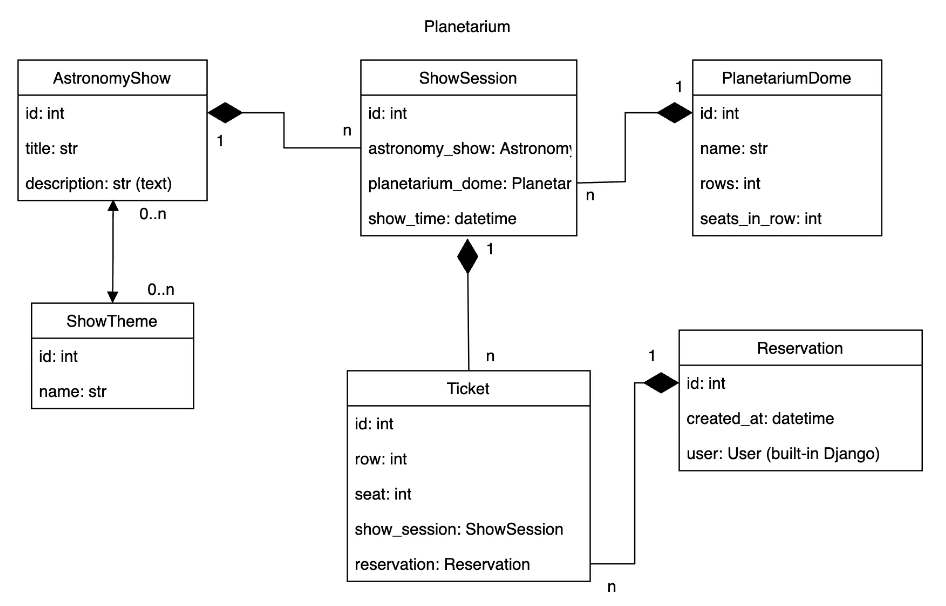
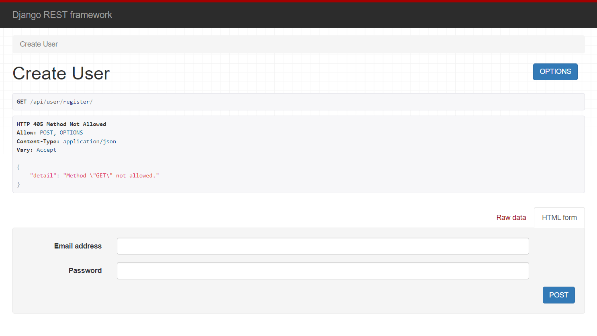
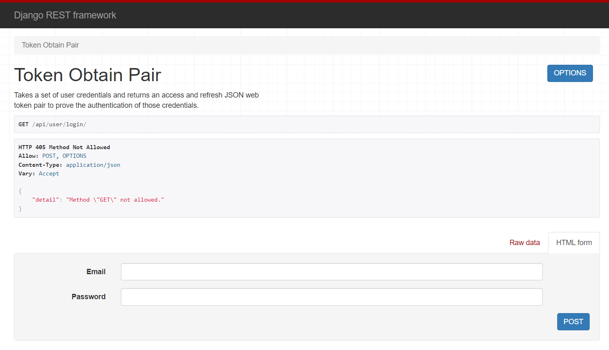
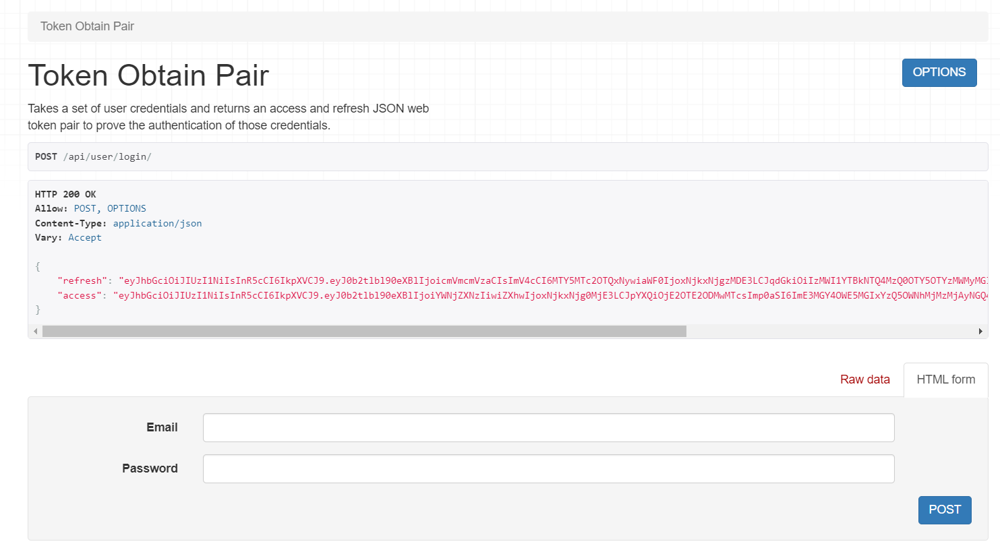
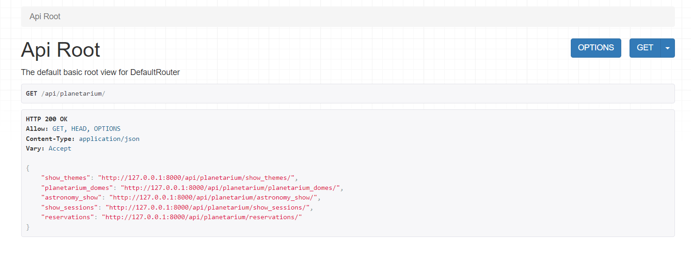
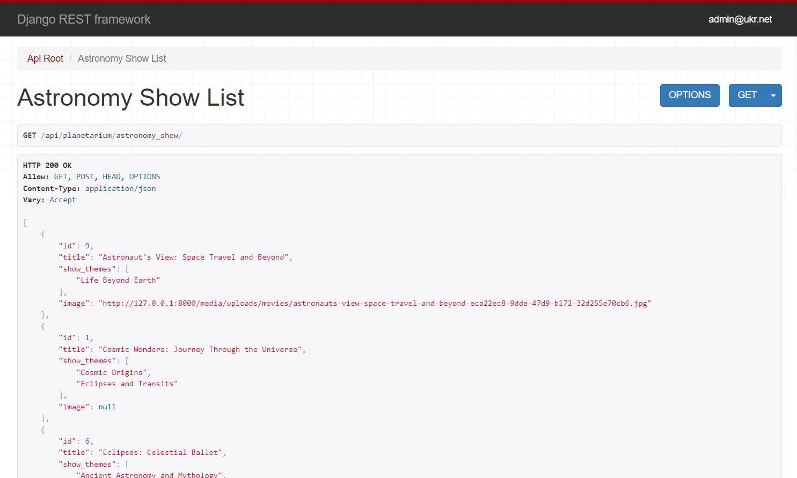
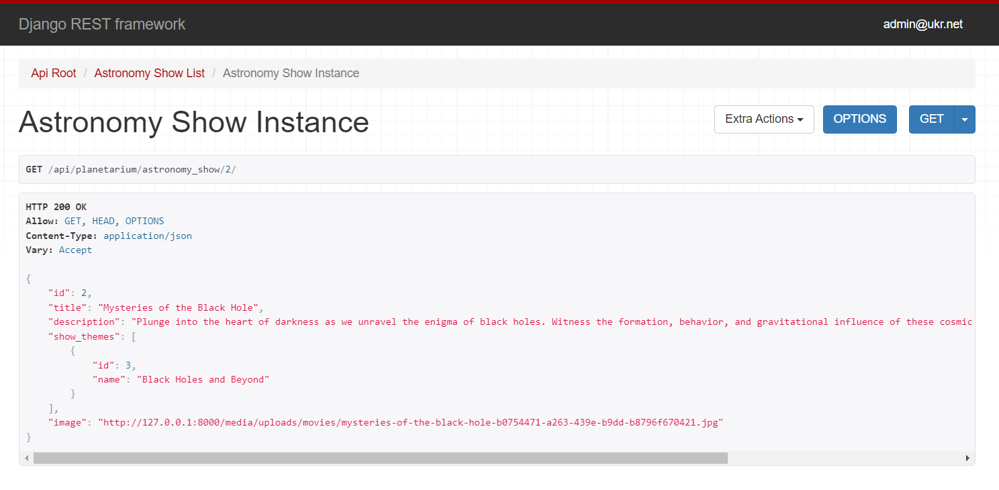
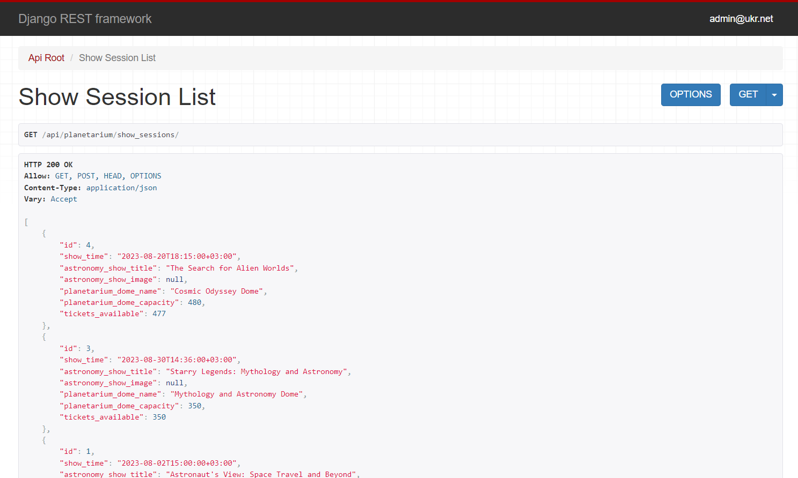
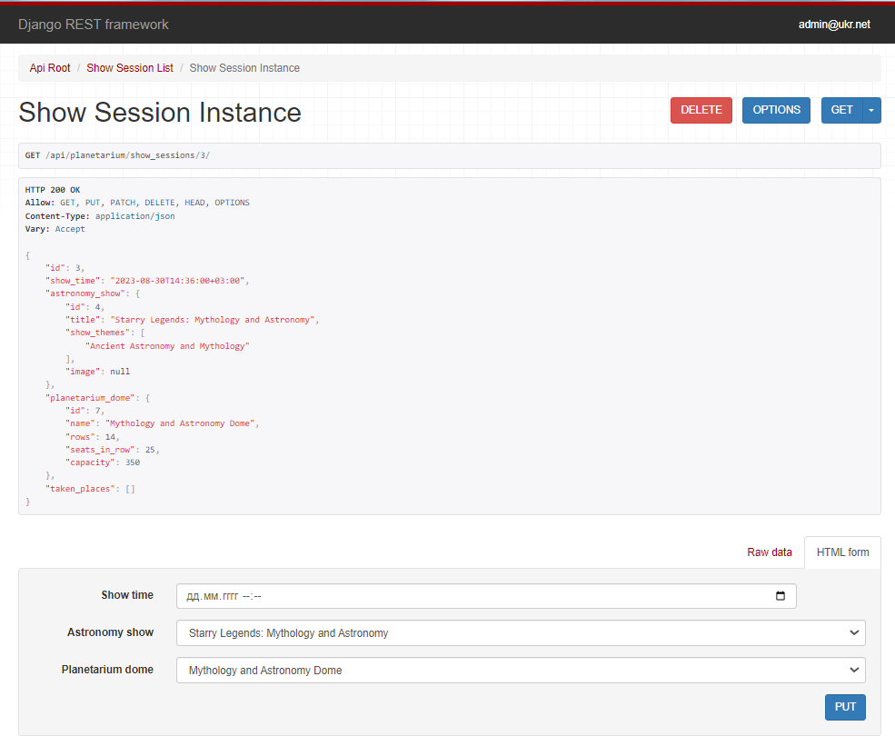
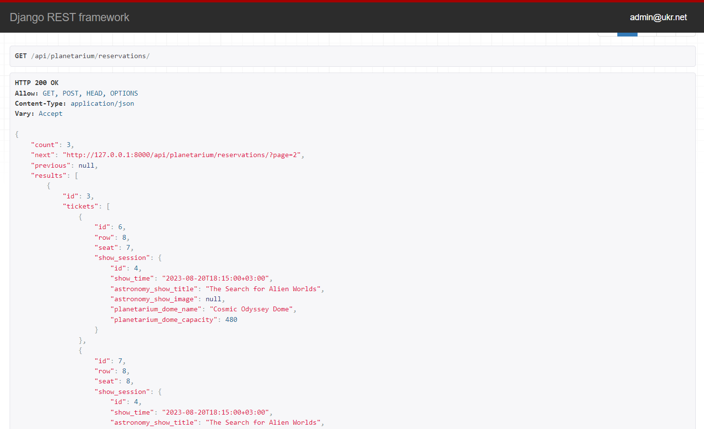

# Planetarium-service-API

Prodject for ordering tickets to Local Planetarium Show Session with users, astronomy shows, show themes and planetarium domes

# Run using Docker

Docker must be already installed

```shell
git clone https://github.com/ant-komarov/planetarium-service
cd planetarium-service
docker-compose up --build
```

# Shut down

```shell
ctrl + C # stop running app
```

# How to use

After running docker container:
* Run in your browser: 127.0.0.1:8000/api/user/register/
* Input email and password
* Go to 127.0.0.1:8000/api/user/login/
* Input credentials you register and receive access and refresh tokens (by default access token valid for 20 minutes, refresh token valid for 1 day)
* Access-token can be refreshed on 127.0.0.1:8000/api/user/token/refresh/ by using refresh-token
* Access token can be verified on 127.0.0.1:8000/api/user/token/verify/

# API documentation
* Run in your browser: 127.0.0.1:8000/api/doc/swagger/ or 127.0.0.1:8000/api/doc/redoc/
* Schema is available on 127.0.0.1:8000/api/schema/

# Features

* Authentication and authorisation functionality for User using JWT
* For admin: managing Show themes, Astronomy shows, Planetarium domes, Show sessions, creating Reservations with tickets
* For user: listing Show themes, Astronomy shows, Planetarium domes, Show sessions, creating Reservations with tickets
* Filtering Show sessions by astronomy show id and by date
* Filtering Astronomy shows by title and by show themes ids
* Pagination for Reservations list
* Uploading images for Astronomy shows

# DB Structure



# Demo










